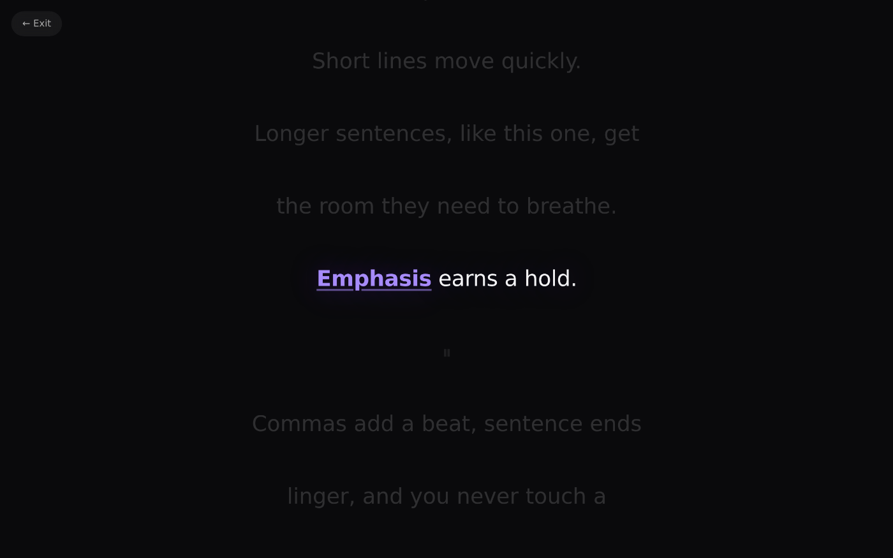
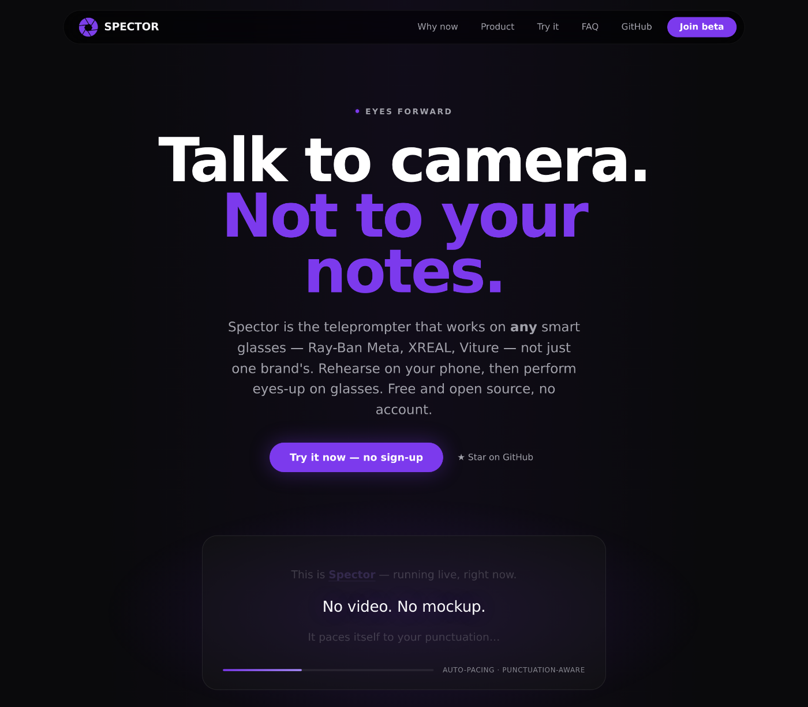

# Spector — Talk to camera. Not to your notes.

Auto-paced, comfort-tuned teleprompter for smart glasses and serious rehearsal.
**Free core, forever. No account, no cloud, nothing uploaded — ever.**

*The actual player, mid-rehearsal — dimmed context, one active line, `**emphasis**` earning a longer hold. [Try it live](https://spectorlabs.io), no sign-up.*

Spector is a free, open-source teleprompter PWA built by one person for the
smart-glasses era. Rehearse on your phone with adaptive, punctuation-aware
pacing, then perform eyes-up on whatever glasses you have — it's cross-brand
by design, not locked to any manufacturer.

> Not affiliated with Meta, Ray-Ban, or any glasses manufacturer. Works with any smart-glasses workflow.

---

## Quick start

1. Open **https://spectorlabs.io**
2. Tap **Try Spector free**, or paste text / drop a `.txt` / load a sample under Try it
3. Open the player (hero CTA or **Try with this script**)
4. Pick a mode (try **Comfort**), speed, and text size
5. Tap Play (or press Space) — the engine paces itself to your punctuation
6. When done, review your pacing, hesitations, and slowest chunk on the end screen

Keyboard: `Space`/`K` play/pause, `R` rewind 3 chunks. Tap anywhere outside the controls to toggle playback. Install as a PWA (via the install hint on the landing, or your browser menu) for offline use.

---

## Key features

| Area                  | What Spector delivers                              |
|-----------------------|----------------------------------------------------|
| **Adaptive pacing**   | Hybrid chunking (sentences → ~6-word groups), punctuation-aware timing, speed presets |
| **Comfort spatial**   | Kalman-filtered device motion → subtle head-tilt translation/rotation/scale + breathing & drift (Comfort mode) |
| **Cue markers**       | `**emphasis**` (stronger hold + styling), `[pause]`, `[pause:3s]`, `## Section` inline syntax |
| **Player modes**      | Comfort (spatial + breathing), Focus (static & crisp), Presentation (larger, bold) |
| **Rehearsal analytics** | End screen: chunks, time, avg WPM, pacing consistency %, hesitations, slowest moment |
| **Script library**    | Save, load, delete — stored locally in your browser, file upload + drag/drop |
| **Mirror mode**       | Horizontal flip for camera-facing / mirror rigs |
| **PWA + offline**     | Installable, service-worker cached, verified offline |
| **Portable core**     | `window.SpectorCore` — chunking, timing, motion, analytics as a pure logic layer, designed to port to glasses SDKs |

### Cue syntax

| Syntax               | Effect                                     |
|----------------------|--------------------------------------------|
| `**word or phrase**` | Visual emphasis + ~12% longer hold         |
| `[pause]`            | ~2.8s pause chunk (1.8s mid-sentence)      |
| `[pause:3s]`         | Explicit N-second pause                    |
| `## Section Name`    | Section header — becomes a jump button in the player |

---

## Say — switch-scan AAC composer (early)

A separate mode at [/say](https://spectorlabs.io/say): spell out a message
with a single tap, key press, or assistive switch, then show it large on
screen for someone else to read. It scans row-by-row, then letter-by-letter
within the row you pick — the same row-column scanning technique behind
Stephen Hawking's speech system, not literal brainwave reading. Built for
people who are non-verbal or Deaf; no camera, no translation, no account —
same free-forever, nothing-uploaded promise as the rest of Spector. This is
new and hasn't been tested with real AAC users yet — [feedback welcome](https://github.com/hydrogenbondss/SPECTOR/discussions).

---

## What works on which glasses, today

Honest answer, kept current on the site's [device matrix](https://spectorlabs.io/#devices):
any phone or computer gets the full experience right now; **XREAL and Viture work
today** as mirrored displays; camera-only Ray-Ban Meta (Gen 1/2) is
rehearsal-on-phone until Meta opens its platform; Ray-Ban Display can't show
Spector on the lens yet, so phone rehearsal is the answer there too. If your device isn't honestly covered,
[tell us](https://spectorlabs.io/#beta) and we'll test it.

### vs. Meta's built-in teleprompter

| Aspect              | Meta (today)                       | Spector                                   |
|---------------------|------------------------------------|-------------------------------------------|
| Hardware            | $799 Ray-Ban Display only          | Any glasses that show a screen — and your phone |
| Pacing              | Manual (taps / swipes)             | Auto-adaptive + manual override           |
| Script reuse        | None                               | Local library, one-tap relaunch           |
| Rehearsal feedback  | None                               | Pacing %, hesitations, slowest moment     |
| Account             | Meta account required              | None, ever                                |
| Source              | Closed                             | MIT, this repo                            |

---

## Beta — real-glasses testers wanted

The web player is fully usable today. What we need now is validation on real
hardware: temple-button controls, HUD readability, and Comfort mode on actual
devices (Ray-Ban Meta, XREAL, Viture, Brilliant Labs, Even Realities…).
Founding testers get Spector Pro free for life.

**Sign up on [the site](https://spectorlabs.io/#beta)** or email
[hello@spectorlabs.io](mailto:hello@spectorlabs.io).

---

## For developers

- `SpectorCore` (in `public/app.html`) is the pure logic layer: `chunk()`, `getMs()`, `buildRehearsalAnalytics()`, `createMotion()`, Kalman filter, cue handling.
- Zero dependencies, static hosting only. The whole app is `public/`.
- In-browser test harness: open `app.html?test` (expects `SpectorTest: ALL PASS`).
- Full verifier: `python tests/run_verification.py` (spins up a local server and exercises the PWA/service-worker/test paths).
- Debug scaffolding (button sim, tilt sim) is behind `app.html?debug` — see [TESTING.md](TESTING.md), which also covers testing on real glasses.
- Security: see [SECURITY.md](SECURITY.md) to report a vulnerability or run a local self-audit before a release.

Working docs — project status, brand guidelines, and domain notes — live in
[`docs/`](docs/).

---

## Contributing

This is early, and issues and PRs are welcome — see
[CONTRIBUTING.md](CONTRIBUTING.md) for the dev setup and testing flow. Focus
areas right now: real-glasses feedback, cue authoring UX, and analytics depth.

Questions, ideas, or something you built with it? Use
[GitHub Discussions](https://github.com/hydrogenbondss/SPECTOR/discussions).
What's shipped is in [CHANGELOG.md](CHANGELOG.md) —
[watch the repo](https://github.com/hydrogenbondss/SPECTOR/subscription) for release notifications.

## License & disclaimer

[MIT](LICENSE). Spector is teleprompter software only — not smart glasses, not
Meta hardware, and not affiliated with Meta Platforms, EssilorLuxottica, or Ray-Ban.

---

**Built for the moment before built-in HUD teleprompters become truly great.**

Live: https://spectorlabs.io · Status: [docs/PROJECT.md](docs/PROJECT.md) · Glasses testing: [TESTING.md](TESTING.md)
